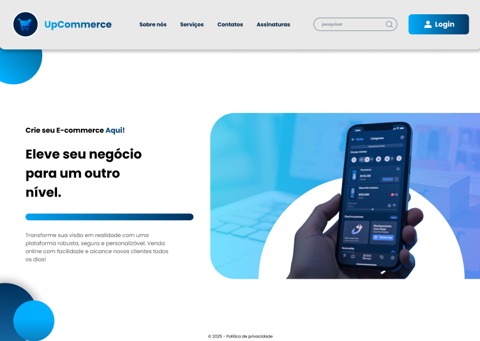

# Entra21 C# - TCC UpCommerce FrontEnd

### Layout Desktop


### Layout Mobile


Layout Responsivo para Desktop | Laptop | Tablet | Mobile

## Índice

- [Instalação](#instalação)
- [Autor](#autor)
- [Tecnologias](#tecnologias)
- [Referências](#referências)
- [Agradecimentos](#agradecimentos)

## Instalação

Instruções para instalar e configurar o projeto.

```sh
# Clone o repositório
git clone https://github.com/yLucino/Entra21-TCC-UpCommerce.git

# Navegue até o diretório do projeto
cd Entra21-TCC-UpCommerce

# Instale as dependências
npm install
```

## Autor

<div style="display: inline_block">
  
  <a href="https://www.github.com/yLucino" target="_blank">Luciano Chiodini - yLucino</a><br>

  
  <a href="https://www.github.com/cunha24025" target="_blank">João Gabriel da Cunha - cunha24025</a><br>
  
  
  <a href="https://www.github.com/sgarciaisabela" target="_blank">Isabela Garcia - sgarciaisabela</a>
</div>

## Tecnologias

<div style="display: inline_block"><br>
  
  
  
  
  
  
</div>

## Referências

📷 <a href="https://www.canva.com/design/DAGktZRjSS0/83JcUau1N7sM14nT80oxHA/edit?utm_content=DAGktZRjSS0&utm_campaign=designshare&utm_medium=link2&utm_source=sharebutton" target="_blank">Canva da UpCommerce</a><br>
🎥 <a href="https://www.youtube.com/watch?v=H5BG7qBKjlM" target="_blank">AdSense da UpCommerce</a><br>

## Agradecimentos

Obrigado por visitar o repositório! 🙂🫡
